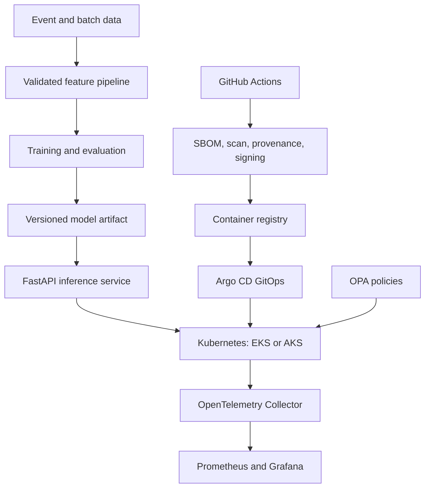

# Secure Multi-Cloud AI Platform

[](https://github.com/josepharayemi-netizen/secure-multicloud-ai-platform/actions/workflows/ci.yml)
[](https://github.com/josepharayemi-netizen/secure-multicloud-ai-platform/actions/workflows/supply-chain.yml)

An enterprise-grade reference platform demonstrating how to train, package, secure, deploy, observe, and govern an AI service across AWS and Microsoft Azure.

## Why this project matters

Most portfolio projects stop at a notebook or API. This repository demonstrates the wider production system expected from a Secure AI/Data Platform Architect: reproducible ML, container delivery, Kubernetes, GitOps, infrastructure as code, telemetry, policy enforcement, signed artifacts, incident response, disaster recovery, and cost awareness.

## Architecture



## Demonstrated competencies

| Discipline | Evidence |
|---|---|
| AI Engineering | Feature pipeline, model training, explainable predictions, model contract |
| MLOps | Versioned artifacts, quality gate, deployment manifest, canary-ready health probes |
| Data Engineering | Versioned event contract, replay-safe micro-batches, validation and lineage metadata |
| DevOps | Docker, Kubernetes, Helm, Argo CD, GitHub Actions, automated testing |
| Cloud Architecture | Terraform reference architectures for AWS EKS and Azure AKS |
| Cloud Security | Least privilege, network policy, non-root containers, OPA, SBOM and provenance |
| Reliability | SLOs, HPA, disruption budget, metrics, traces, runbook and rollback |
| FinOps | Environment sizing, cost assumptions and teardown controls |

## Local quick start

```bash
python -m venv .venv
source .venv/bin/activate   # Windows: .venv\Scripts\activate
pip install -r requirements.txt
python -m src.platform_api.train
uvicorn src.platform_api.api:app --host 0.0.0.0 --port 8000
```

Open <http://localhost:8000/docs>, or run the complete local observability stack:

```bash
docker compose up --build
```

## Example prediction

```bash
curl -X POST http://localhost:8000/v1/predict \
  -H "Content-Type: application/json" \
  -d '{"transaction_amount":8500,"velocity_1h":9,"account_age_days":3,"country_mismatch":true}'
```

The response contains the model version, probability, decision, reason codes, and trace ID.

## Deployment paths

### Kubernetes and GitOps

```bash
kubectl apply -k deploy/kubernetes/base
helm upgrade --install secure-ai deploy/helm
kubectl apply -f gitops/application.yaml
```

### AWS

The AWS reference provisions a private-networked EKS platform, encrypted artifact bucket, ECR registry, KMS key, and audit logging boundaries.

```bash
cd terraform/aws
terraform init && terraform validate && terraform plan
```

### Azure

The Azure reference provisions AKS with workload identity, ACR, encrypted storage, Log Analytics, Key Vault, and private networking controls.

```bash
cd terraform/azure
terraform init && terraform validate && terraform plan
```

## Security and governance

- Workload identity instead of long-lived cloud credentials
- Read-only root filesystem and non-root container execution
- Kubernetes NetworkPolicy and Pod Security controls
- OPA policy tests for trusted registries, resource limits and prohibited privilege
- Dependency and container scanning
- CycloneDX SBOM, vulnerability gate and SLSA provenance in CI
- Model contract, threat model and NIST AI RMF control mapping
- No automatic production remediation or deployment from pull requests

## Reliability objectives

| Indicator | Objective |
|---|---|
| Availability | 99.9% monthly |
| p95 inference latency | Below 250 ms |
| Error rate | Below 1% |
| Recovery time objective | 30 minutes |
| Recovery point objective | 15 minutes |

## Repository map

```text
src/                 training, inference, data contracts and telemetry code
tests/               unit and contract tests
docker-compose.yml   local platform and observability stack
deploy/kubernetes/   production-style manifests
deploy/helm/         reusable deployment chart
gitops/              Argo CD desired state
terraform/           AWS and Azure reference infrastructure
observability/       OpenTelemetry, Prometheus and Grafana
policies/            OPA policy-as-code
docs/                ADRs, threat model, runbook, DR and FinOps
```

## Important scope note

The local AI service is fully runnable. Cloud directories are reviewable reference infrastructure and intentionally require the operator's own account, remote state, approved regions, identity configuration, budgets, and deployment approval before `terraform apply`.

## License

MIT
